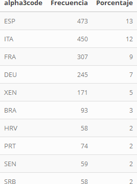
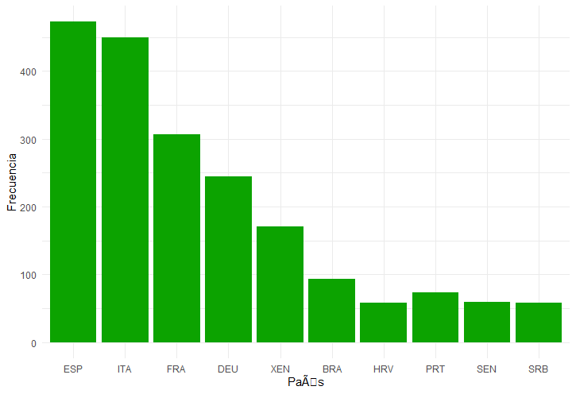

------------------------------------------------------------------------

`{r setup, include=FALSE, cache=TRUE} library(knitr) library(rmarkdown) library(tidyverse) library(ggplot2) library(kableExtra) library(jsonlite)`

Carga de los datos
------------------

### Jugadores Data

\`\`\`{r, cache=TRUE, include=TRUE, message=FALSE, warning=FALSE}
players &lt;- fromJSON(“data/players.json”)

\`\`\`

------------------------------------------------------------------------

Jugadores
---------
                                                            

`{r, cache=TRUE, include=TRUE, message=FALSE, warning=FALSE} players$passportArea %>%   group_by(alpha3code) %>%   summarise(Frecuencia = n()) %>%   mutate(Porcentaje = round(prop.table(Frecuencia),2) * 100)%>%   arrange(desc(Porcentaje)) %>%   head(10) %>%   kable() %>%   kable_styling(bootstrap_options = "striped", full_width = F, position = "center")`

Se aprecia como España es el país que aporta el mayor número de
jugadores a las cinco grandes ligas de Europa.

`{r, cache=TRUE, include=TRUE, message=FALSE, warning=FALSE} players$passportArea %>%   group_by(alpha3code) %>%   summarise(Frecuencia = n()) %>%   mutate(Porcentaje = round(prop.table(Frecuencia),2) * 100)%>%   arrange(desc(Porcentaje)) %>%   head(10) %>%   mutate(alpha3code = factor(alpha3code, levels=alpha3code)) %>%   ggplot(aes(x=alpha3code, y=Frecuencia)) +   geom_col(fill ="#0CA300") +   xlab("País") +   theme_minimal()`
